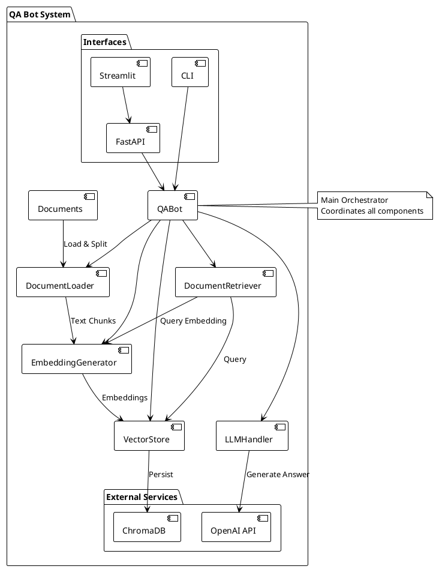
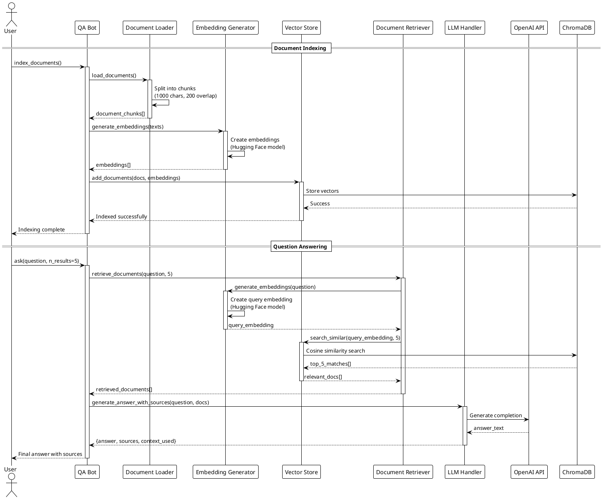

# Building a Smart QA Bot with LLM and Vector Search

**Create an intelligent document-based question answering system using Python, OpenAI, ChromaDB, and FastAPI**

## Overview

In this tutorial, we'll build a comprehensive QA Bot system that can intelligently answer questions based on your documents. The system uses Large Language Models (LLMs) and vector search technology to provide accurate, context-aware responses with source attribution.

**📁 Complete Source Code:** [QA Bot Repository](https://github.com/your-username/qa-bot)

## What We'll Build

Our QA Bot system will include:

- **Document Processing**: Load and chunk PDF, Markdown, and text files
- **Vector Embeddings**: Convert documents to searchable vector representations
- **Smart Retrieval**: Find relevant document sections using similarity search
- **LLM Integration**: Generate intelligent answers with source citations
- **Multiple Interfaces**: FastAPI REST API, Streamlit web app, and CLI
- **Comprehensive Testing**: Full test suite with pytest

## System Architecture

The system follows a modular pipeline architecture where each component has a specific responsibility:



## Component Flow Diagram

Here's how data flows through our system:



## Prerequisites

- Python 3.12+
- OpenAI API key
- Basic knowledge of Python, APIs, and vector databases

## Step 1: Project Setup

### Directory Structure

Create the following project structure:

```
qa-bot/
├── src/
│   ├── __init__.py
│   ├── qa_bot.py          # Main orchestrator
│   ├── document_loader.py  # Document processing
│   ├── embeddings.py      # Embedding generation
│   ├── vector_store.py    # ChromaDB interface
│   ├── retriever.py       # Document retrieval
│   └── llm.py            # LLM integration
├── tests/
│   ├── __init__.py
│   ├── conftest.py       # Test configuration
│   ├── test_qa_bot.py    # Main component tests
│   ├── test_document_loader.py
│   ├── test_embeddings.py
│   ├── test_vector_store.py
│   ├── test_retriever.py
│   ├── test_llm.py
│   └── test_api.py       # API endpoint tests
├── documents/            # Your documents go here
├── app.py               # FastAPI backend
├── streamlit_app.py     # Web interface
├── cli_example.py       # Command-line interface
├── requirements.txt     # Dependencies
├── .env.example        # Environment template
├── pytest.ini         # Test configuration
└── README.md
```

### Install Dependencies

```bash
pip install -r requirements.txt
```

**requirements.txt:**
```
fastapi==0.104.1
uvicorn==0.24.0
streamlit==1.28.1
langchain==0.1.0
langchain-openai==0.0.2
chromadb==0.4.18
pypdf==3.17.1
python-multipart==0.0.6
python-dotenv==1.0.0
openai>=1.6.1,<2.0.0
sentence-transformers>=2.3.0
tiktoken==0.5.2
pytest==7.4.3
pytest-asyncio==0.21.1
httpx==0.25.2
pytest-cov
```

### Environment Configuration

Create `.env` file:
```env
OPENAI_API_KEY=your_openai_api_key_here
EMBEDDING_MODEL=text-embedding-ada-002
LLM_MODEL=gpt-3.5-turbo
CHROMA_PERSIST_DIRECTORY=./chroma_db
DOCUMENTS_PATH=./documents
```

## Step 2: Core Components Implementation

### Document Loader (`src/document_loader.py`)

```python
import os
from typing import List, Dict
from langchain.text_splitter import RecursiveCharacterTextSplitter
from langchain.document_loaders import PyPDFLoader, TextLoader
import hashlib

class DocumentLoader:
    def __init__(self, documents_path: str = "./documents"):
        self.documents_path = documents_path
        self.text_splitter = RecursiveCharacterTextSplitter(
            chunk_size=1000,
            chunk_overlap=200,
            length_function=len,
        )
    
    def load_documents(self) -> List[Dict]:
        documents = []
        
        if not os.path.exists(self.documents_path):
            print(f"Documents path {self.documents_path} does not exist.")
            return documents
        
        for filename in os.listdir(self.documents_path):
            file_path = os.path.join(self.documents_path, filename)
            
            if filename.lower().endswith('.pdf'):
                documents.extend(self._load_pdf(file_path))
            elif filename.lower().endswith(('.md', '.txt')):
                documents.extend(self._load_text(file_path))
        
        return documents
    
    def _load_pdf(self, file_path: str) -> List[Dict]:
        loader = PyPDFLoader(file_path)
        pages = loader.load()
        
        documents = []
        for page in pages:
            chunks = self.text_splitter.split_text(page.page_content)
            for i, chunk in enumerate(chunks):
                doc_id = hashlib.md5(f"{file_path}_{page.metadata.get('page', 0)}_{i}".encode()).hexdigest()
                documents.append({
                    'id': doc_id,
                    'content': chunk,
                    'source': os.path.basename(file_path),
                    'page': page.metadata.get('page', 0),
                    'chunk_index': i
                })
        
        return documents
    
    def _load_text(self, file_path: str) -> List[Dict]:
        loader = TextLoader(file_path)
        document = loader.load()[0]
        
        chunks = self.text_splitter.split_text(document.page_content)
        documents = []
        
        for i, chunk in enumerate(chunks):
            doc_id = hashlib.md5(f"{file_path}_{i}".encode()).hexdigest()
            documents.append({
                'id': doc_id,
                'content': chunk,
                'source': os.path.basename(file_path),
                'chunk_index': i
            })
        
        return documents
```

### Embedding Generator (`src/embeddings.py`)

```python
import os
from typing import List
import openai
from sentence_transformers import SentenceTransformer

class EmbeddingGenerator:
    def __init__(self, model_type: str = "openai", model_name: str = None):
        self.model_type = model_type
        
        if model_type == "openai":
            self.client = openai.OpenAI(api_key=os.getenv("OPENAI_API_KEY"))
            self.model_name = model_name or "text-embedding-ada-002"
        elif model_type == "huggingface":
            self.model_name = model_name or "all-MiniLM-L6-v2"
            self.model = SentenceTransformer(self.model_name)
        else:
            raise ValueError(f"Unsupported model type: {model_type}")
    
    def generate_embeddings(self, texts: List[str]) -> List[List[float]]:
        if self.model_type == "openai":
            return self._generate_openai_embeddings(texts)
        elif self.model_type == "huggingface":
            return self._generate_huggingface_embeddings(texts)
    
    def _generate_openai_embeddings(self, texts: List[str]) -> List[List[float]]:
        embeddings = []
        
        for text in texts:
            response = self.client.embeddings.create(
                input=text,
                model=self.model_name
            )
            embeddings.append(response.data[0].embedding)
        
        return embeddings
    
    def _generate_huggingface_embeddings(self, texts: List[str]) -> List[List[float]]:
        embeddings = self.model.encode(texts)
        return embeddings.tolist()
```

### Vector Store (`src/vector_store.py`)

```python
import chromadb
from typing import List, Dict, Optional

class VectorStore:
    def __init__(self, persist_directory: str = "./chroma_db"):
        self.client = chromadb.PersistentClient(path=persist_directory)
        self.collection_name = "qa_documents"
        self.collection = self._get_or_create_collection()
    
    def _get_or_create_collection(self):
        return self.client.get_or_create_collection(
            name=self.collection_name,
            metadata={"hnsw:space": "cosine"}
        )
    
    def add_documents(self, documents: List[Dict], embeddings: List[List[float]]):
        ids = [doc['id'] for doc in documents]
        texts = [doc['content'] for doc in documents]
        metadatas = [{
            'source': doc['source'],
            'page': doc.get('page', 0),
            'chunk_index': doc['chunk_index']
        } for doc in documents]
        
        self.collection.add(
            embeddings=embeddings,
            documents=texts,
            metadatas=metadatas,
            ids=ids
        )
    
    def search_similar(self, query_embedding: List[float], n_results: int = 5) -> List[Dict]:
        results = self.collection.query(
            query_embeddings=[query_embedding],
            n_results=n_results,
            include=['documents', 'metadatas', 'distances']
        )
        
        similar_docs = []
        for i in range(len(results['documents'][0])):
            similar_docs.append({
                'content': results['documents'][0][i],
                'metadata': results['metadatas'][0][i],
                'distance': results['distances'][0][i]
            })
        
        return similar_docs
    
    def get_collection_count(self) -> int:
        return self.collection.count()
    
    def reset_collection(self):
        self.client.delete_collection(self.collection_name)
        self.collection = self._get_or_create_collection()
```

## Step 3: Intelligence Layer

### Document Retriever (`src/retriever.py`)

```python
from typing import List, Dict
from .vector_store import VectorStore
from .embeddings import EmbeddingGenerator

class DocumentRetriever:
    def __init__(self, vector_store: VectorStore, embedding_generator: EmbeddingGenerator):
        self.vector_store = vector_store
        self.embedding_generator = embedding_generator
    
    def retrieve_documents(self, query: str, n_results: int = 5) -> List[Dict]:
        query_embedding = self.embedding_generator.generate_embeddings([query])[0]
        
        similar_docs = self.vector_store.search_similar(query_embedding, n_results)
        
        # Filter out documents with very low similarity (distance > 0.8)
        filtered_docs = [doc for doc in similar_docs if doc['distance'] < 0.8]
        
        return filtered_docs
```

### LLM Handler (`src/llm.py`)

```python
import os
from typing import List, Dict
import openai

class LLMHandler:
    def __init__(self, model_name: str = "gpt-3.5-turbo"):
        self.client = openai.OpenAI(api_key=os.getenv("OPENAI_API_KEY"))
        self.model_name = model_name
    
    def generate_answer_with_sources(self, question: str, retrieved_docs: List[Dict]) -> Dict:
        context = self._prepare_context(retrieved_docs)
        
        prompt = f"""Based on the following context, answer the question. 
If you cannot find the answer in the context, say "I don't have enough information to answer this question."

Context:
{context}

Question: {question}

Please provide a comprehensive answer and cite your sources."""

        response = self.client.chat.completions.create(
            model=self.model_name,
            messages=[
                {"role": "system", "content": "You are a helpful assistant that answers questions based on provided context. Always cite your sources."},
                {"role": "user", "content": prompt}
            ],
            temperature=0.7,
            max_tokens=1000
        )
        
        answer = response.choices[0].message.content
        
        sources = self._extract_sources(retrieved_docs)
        
        return {
            "answer": answer,
            "sources": sources,
            "context_used": len(retrieved_docs)
        }
    
    def _prepare_context(self, docs: List[Dict]) -> str:
        context_parts = []
        for i, doc in enumerate(docs, 1):
            source = doc['metadata']['source']
            page = doc['metadata'].get('page', 'N/A')
            content = doc['content']
            
            context_parts.append(f"[Source {i}: {source}, Page {page}]\n{content}\n")
        
        return "\n".join(context_parts)
    
    def _extract_sources(self, docs: List[Dict]) -> List[Dict]:
        sources = []
        for doc in docs:
            sources.append({
                'source': doc['metadata']['source'],
                'page': doc['metadata'].get('page', 'N/A'),
                'relevance_score': 1 - doc['distance']  # Convert distance to relevance
            })
        
        return sources
```

## Step 4: Main Orchestrator

### QA Bot (`src/qa_bot.py`)

```python
import os
from typing import Dict, List
from .document_loader import DocumentLoader
from .embeddings import EmbeddingGenerator
from .vector_store import VectorStore
from .retriever import DocumentRetriever
from .llm import LLMHandler

class QABot:
    def __init__(self, 
                 documents_path: str = "./documents",
                 persist_directory: str = "./chroma_db",
                 embedding_model_type: str = "openai",
                 embedding_model_name: str = None,
                 llm_model: str = "gpt-3.5-turbo"):
        
        self.document_loader = DocumentLoader(documents_path)
        self.embedding_generator = EmbeddingGenerator(embedding_model_type, embedding_model_name)
        self.vector_store = VectorStore(persist_directory)
        self.retriever = DocumentRetriever(self.vector_store, self.embedding_generator)
        self.llm_handler = LLMHandler(llm_model)
        
        self.is_indexed = False
    
    def index_documents(self, force_reindex: bool = False):
        if self.is_indexed and not force_reindex:
            print("Documents already indexed. Use force_reindex=True to reindex.")
            return
        
        if force_reindex:
            self.vector_store.reset_collection()
        
        print("Loading documents...")
        documents = self.document_loader.load_documents()
        
        if not documents:
            print("No documents found to index.")
            return
        
        print(f"Generating embeddings for {len(documents)} document chunks...")
        texts = [doc['content'] for doc in documents]
        embeddings = self.embedding_generator.generate_embeddings(texts)
        
        print("Storing documents in vector database...")
        self.vector_store.add_documents(documents, embeddings)
        
        self.is_indexed = True
        print(f"Indexing complete! {len(documents)} chunks indexed.")
    
    def ask(self, question: str, n_results: int = 5) -> Dict:
        if not self.is_indexed and self.vector_store.get_collection_count() == 0:
            return {
                "error": "No documents indexed. Please run index_documents() first."
            }
        
        print(f"Retrieving relevant documents for: {question}")
        retrieved_docs = self.retriever.retrieve_documents(question, n_results)
        
        if not retrieved_docs:
            return {
                "answer": "No relevant documents found for your question.",
                "sources": [],
                "context_used": 0
            }
        
        print("Generating answer...")
        result = self.llm_handler.generate_answer_with_sources(question, retrieved_docs)
        
        return result
    
    def get_stats(self) -> Dict:
        return {
            "total_documents": self.vector_store.get_collection_count(),
            "is_indexed": self.is_indexed,
            "embedding_model": f"{self.embedding_generator.model_type}:{self.embedding_generator.model_name}",
            "llm_model": self.llm_handler.model_name
        }
```

## Step 5: Application Interfaces

### FastAPI Backend (`app.py`)

```python
import os
from fastapi import FastAPI, HTTPException
from fastapi.middleware.cors import CORSMiddleware
from pydantic import BaseModel
from dotenv import load_dotenv
from src.qa_bot import QABot

load_dotenv()

app = FastAPI(title="QA Bot API", version="1.0.0")

app.add_middleware(
    CORSMiddleware,
    allow_origins=["*"],
    allow_credentials=True,
    allow_methods=["*"],
    allow_headers=["*"],
)

qa_bot = None

class QuestionRequest(BaseModel):
    question: str
    n_results: int = 5

class IndexRequest(BaseModel):
    force_reindex: bool = False

@app.on_event("startup")
async def startup_event():
    global qa_bot
    
    documents_path = os.getenv("DOCUMENTS_PATH", "./documents")
    persist_directory = os.getenv("CHROMA_PERSIST_DIRECTORY", "./chroma_db")
    embedding_model_type = os.getenv("EMBEDDING_MODEL_TYPE", "openai")
    embedding_model_name = os.getenv("EMBEDDING_MODEL", None)
    llm_model = os.getenv("LLM_MODEL", "gpt-3.5-turbo")
    
    qa_bot = QABot(
        documents_path=documents_path,
        persist_directory=persist_directory,
        embedding_model_type=embedding_model_type,
        embedding_model_name=embedding_model_name,
        llm_model=llm_model
    )
    
    print("QA Bot initialized successfully!")

@app.get("/")
async def root():
    return {"message": "QA Bot API is running!"}

@app.post("/index")
async def index_documents(request: IndexRequest):
    try:
        qa_bot.index_documents(force_reindex=request.force_reindex)
        stats = qa_bot.get_stats()
        return {"message": "Documents indexed successfully", "stats": stats}
    except Exception as e:
        raise HTTPException(status_code=500, detail=str(e))

@app.post("/ask")
async def ask_question(request: QuestionRequest):
    try:
        result = qa_bot.ask(request.question, request.n_results)
        return result
    except Exception as e:
        raise HTTPException(status_code=500, detail=str(e))

@app.get("/stats")
async def get_stats():
    try:
        stats = qa_bot.get_stats()
        return stats
    except Exception as e:
        raise HTTPException(status_code=500, detail=str(e))

if __name__ == "__main__":
    import uvicorn
    uvicorn.run(app, host="0.0.0.0", port=8000)
```

### Streamlit Frontend (`streamlit_app.py`)

```python
import streamlit as st
import requests
import json

API_BASE_URL = "http://localhost:8000"

st.set_page_config(
    page_title="QA Bot",
    page_icon="🤖",
    layout="wide"
)

st.title("🤖 Intelligent QA Bot")
st.markdown("Ask questions about your documents and get intelligent answers with source citations!")

# Sidebar for controls
with st.sidebar:
    st.header("📊 System Status")
    
    if st.button("🔄 Refresh Stats"):
        try:
            response = requests.get(f"{API_BASE_URL}/stats")
            if response.status_code == 200:
                stats = response.json()
                st.success("✅ Connected to API")
                st.write(f"**Documents Indexed:** {stats['total_documents']}")
                st.write(f"**Embedding Model:** {stats['embedding_model']}")
                st.write(f"**LLM Model:** {stats['llm_model']}")
            else:
                st.error("❌ Failed to get stats")
        except:
            st.error("❌ Cannot connect to API")
    
    st.header("📁 Document Management")
    
    force_reindex = st.checkbox("Force Reindex", help="Delete existing index and rebuild from scratch")
    
    if st.button("📚 Index Documents"):
        with st.spinner("Indexing documents..."):
            try:
                response = requests.post(
                    f"{API_BASE_URL}/index",
                    json={"force_reindex": force_reindex}
                )
                if response.status_code == 200:
                    result = response.json()
                    st.success("✅ Documents indexed successfully!")
                    st.json(result["stats"])
                else:
                    st.error(f"❌ Indexing failed: {response.text}")
            except Exception as e:
                st.error(f"❌ Error: {str(e)}")

# Main chat interface
st.header("💬 Ask Your Questions")

# Initialize chat history
if "messages" not in st.session_state:
    st.session_state.messages = []

# Display chat messages
for message in st.session_state.messages:
    with st.chat_message(message["role"]):
        st.markdown(message["content"])

# Chat input
if prompt := st.chat_input("What would you like to know?"):
    # Add user message to chat history
    st.session_state.messages.append({"role": "user", "content": prompt})
    
    # Display user message
    with st.chat_message("user"):
        st.markdown(prompt)
    
    # Get bot response
    with st.chat_message("assistant"):
        with st.spinner("Thinking..."):
            try:
                response = requests.post(
                    f"{API_BASE_URL}/ask",
                    json={"question": prompt, "n_results": 5}
                )
                
                if response.status_code == 200:
                    result = response.json()
                    
                    if "error" in result:
                        st.error(result["error"])
                        assistant_response = result["error"]
                    else:
                        # Display answer
                        st.markdown(result["answer"])
                        
                        # Display sources
                        if result["sources"]:
                            st.markdown("**📚 Sources:**")
                            for i, source in enumerate(result["sources"], 1):
                                relevance = source.get('relevance_score', 0)
                                st.markdown(
                                    f"{i}. **{source['source']}** (Page {source['page']}) "
                                    f"- Relevance: {relevance:.2f}"
                                )
                        
                        assistant_response = result["answer"]
                else:
                    st.error(f"API Error: {response.text}")
                    assistant_response = "Sorry, I encountered an error while processing your question."
                    
            except Exception as e:
                st.error(f"Connection Error: {str(e)}")
                assistant_response = "Sorry, I couldn't connect to the QA Bot service."
    
    # Add assistant response to chat history
    st.session_state.messages.append({"role": "assistant", "content": assistant_response})
```

## Step 6: Testing

**Testing is critical for production-ready AI applications.** A comprehensive test suite ensures reliability, prevents regressions, and validates that all components work correctly together.

### Why Testing Matters

- **AI systems are complex** with multiple interconnected components
- **External dependencies** (OpenAI API, ChromaDB) need proper mocking
- **Document processing** requires validation with different file formats
- **Vector operations** need accuracy verification
- **API endpoints** must handle various input scenarios

### Test Structure

Our testing strategy includes:

- **Unit Tests**: Individual component testing (document loader, embeddings, vector store)
- **Integration Tests**: Full pipeline testing with mocked external services
- **API Tests**: FastAPI endpoint testing with proper fixtures
- **Coverage**: 80%+ test coverage requirement with pytest

### Running Tests

```bash
# Install test dependencies
pip install pytest pytest-asyncio pytest-cov httpx

# Run all tests
pytest -v

# Run with coverage report
pytest --cov=src --cov-report=html

# Run specific test categories
pytest -m unit        # Unit tests only
pytest -m integration # Integration tests only
```

### Key Test Files

- `tests/conftest.py` - Test fixtures and configuration
- `tests/test_qa_bot.py` - Main component and integration tests
- `tests/test_api.py` - FastAPI endpoint tests
- `tests/test_document_loader.py` - Document processing tests
- `tests/test_vector_store.py` - ChromaDB operations tests

**⚠️ Important:** Always mock external API calls (OpenAI) in tests to avoid costs and ensure consistent results.

## Step 7: Running and Testing

### Development Setup

```bash
# Install dependencies
pip install -r requirements.txt

# Set up environment
cp .env.example .env
# Edit .env with your OpenAI API key

# Add some documents to ./documents/ folder

# Run tests
pytest -v

# Run with coverage
pytest --cov=src --cov-report=html
```

### Running the Application

**FastAPI + Streamlit (Recommended):**
```bash
# Terminal 1: Start FastAPI backend
python app.py

# Terminal 2: Start Streamlit frontend
streamlit run streamlit_app.py
```

**CLI Mode:**
```bash
python cli_example.py
```

### API Testing

```bash
# Index documents
curl -X POST "http://localhost:8000/index" \
  -H "Content-Type: application/json" \
  -d '{"force_reindex": false}'

# Ask a question
curl -X POST "http://localhost:8000/ask" \
  -H "Content-Type: application/json" \
  -d '{"question": "What is the main topic?", "n_results": 5}'

# Get system stats
curl -X GET "http://localhost:8000/stats"
```

## Key Features Implemented

✅ **Document Processing**: Automatic loading and chunking of PDF, MD, TXT files  
✅ **Vector Search**: ChromaDB with cosine similarity for document retrieval  
✅ **LLM Integration**: OpenAI GPT for intelligent answer generation  
✅ **Source Attribution**: Automatic citation of source documents and pages  
✅ **Multiple Interfaces**: REST API, web UI, and CLI  
✅ **Comprehensive Testing**: 80%+ test coverage with pytest  
✅ **Flexible Configuration**: Environment-based configuration  
✅ **Error Handling**: Robust error handling and validation  

## Next Steps and Extensions

1. **Add Authentication**: Implement user authentication and API keys
2. **Scale Vector Storage**: Integrate with Pinecone or Weaviate for production scale
3. **Advanced Retrieval**: Implement hybrid search (keyword + vector)
4. **Multi-modal Support**: Add support for images and tables
5. **Conversation Memory**: Add chat history and context preservation
6. **Performance Optimization**: Implement caching and batch processing
7. **Monitoring**: Add logging, metrics, and performance monitoring

## Conclusion

You've built a comprehensive QA Bot system that demonstrates modern AI application architecture. The system showcases:

- **Modular Design**: Clean separation of concerns with testable components
- **Production Patterns**: Proper error handling, configuration, and testing
- **Modern Stack**: FastAPI, ChromaDB, OpenAI, and Streamlit integration
- **Scalable Architecture**: Ready for production deployment and scaling

The complete codebase with all tests and documentation is available at: **[QA Bot Repository](https://github.com/your-username/qa-bot)**

This tutorial provides a solid foundation for building intelligent document-based applications using LLMs and vector search technology.